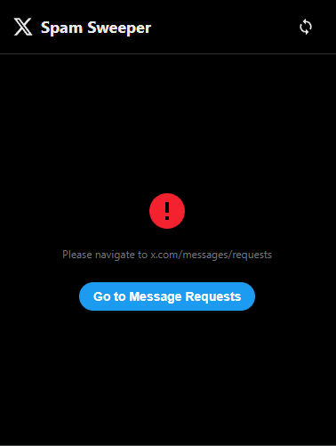
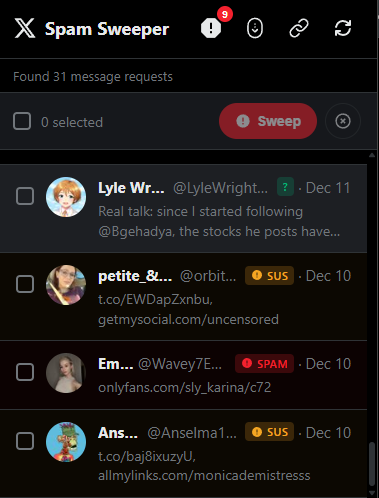
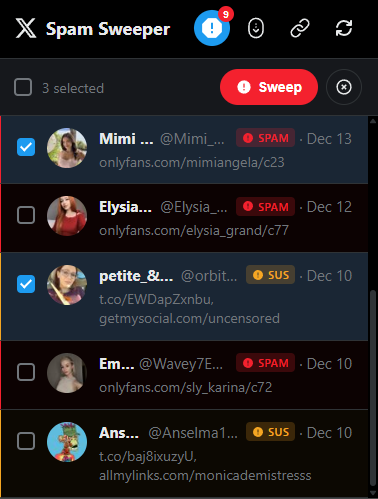
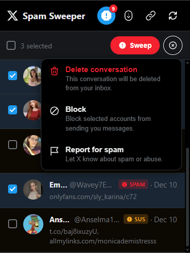
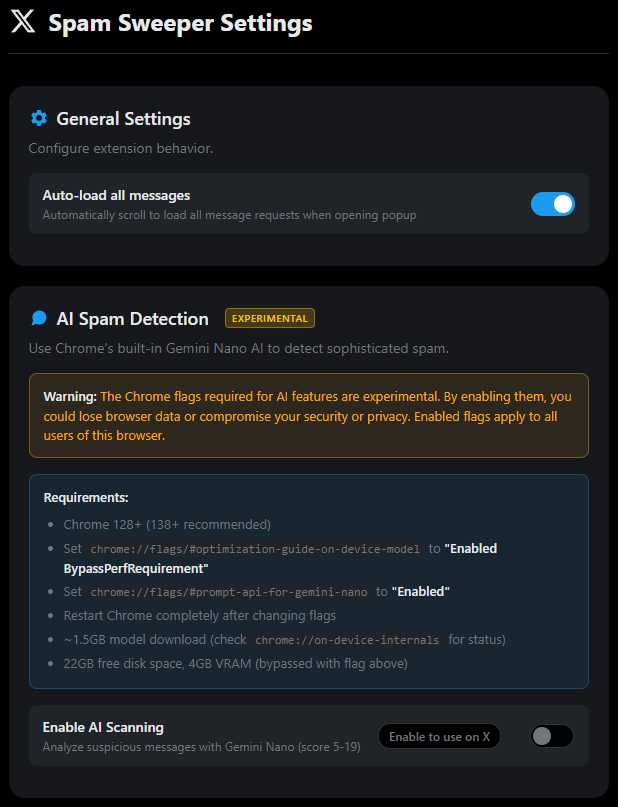
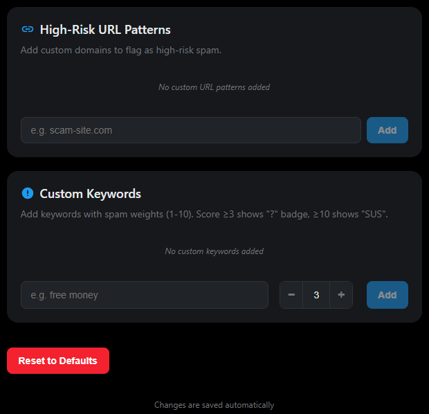

# X Spam Sweeper

    

    
      <b><strong style="font-size: 5rem;">X Spam Sweeper</strong></b>
       "A lightweight Chrome extension to batch report and block spam accounts in X Messages."
    

 

    
    

 

## Screenshots

<h3 align="center">Popup Interface</h3>

    
    
    

    <em>Left: Message requests list with spam risk indicators 
    Center: Multi-select for batch processing 
    Right: Actions dropdown menu</em>

<h3 align="center">Settings Page</h3>

    
    

    <em>Left: General settings and experimental AI spam detection 
    Right: Custom URL patterns and keyword configuration</em>

## Why X Spam Sweeper?

Tired of manually dealing with dozens of spam message requests on X (Twitter)? X Spam Sweeper lets you view, select, and batch-process spam accounts directly from a convenient popup — saving you time and clicks.

## Features

### Core Functionality
* **View Message Requests:** See all your pending message requests in a clean, dark-themed list that matches X's design
* **Multi-Select:** Select individual accounts or use "Select All" to choose multiple spammers at once
* **Real-time Extraction:** Automatically extracts usernames, display names, avatars, message previews, and dates from the X page
* **Native Design:** Dark theme UI that feels like a natural part of X

### Actions
* **Sweep:** One-click action that performs Report → Block → Delete on selected accounts
* **Report:** Automatically reports accounts as spam
* **Block:** Blocks selected accounts
* **Delete:** Removes conversations from your inbox

### Spam Detection
* **Smart Scoring System:** Privacy-first spam filtering with a 0–30 point scoring scale
* **Risk Levels:** Visual indicators for HIGH (≥20), MEDIUM (≥10), and LOW (≥3) risk messages
* **URL Pattern Detection:** Detects suspicious links including:
  - Adult content platforms (OnlyFans, Fansly, etc.)
  - Off-platform redirects (WhatsApp, Telegram)
  - URL shorteners (bit.ly, t.co, etc.)
  - Crypto scam domains
* **Keyword Analysis:** Weights keywords related to crypto/investment scams, urgency tactics, romance scams
* **Safe Domain Whitelist:** YouTube, Spotify, GitHub, etc. subtract from spam score to reduce false positives
* **Hidden Link Resolution:** Resolves t.co shortlinks securely to identify actual destination domains

### Options Page
* **Custom URL Patterns:** Add your own high-risk URL patterns
* **Custom Keywords:** Configure keyword weights for personalized spam detection
* **Settings Sync:** Settings saved to Chrome's sync storage

### Additional Features
* **Spam Filter Toggle:** Shield button to show only suspicious messages
* **SPA Navigation Support:** Works seamlessly with X's single-page app navigation
* **Auto-Refresh:** Popup updates when new messages are detected or links are resolved

## How to Use

1. **Navigate:** Go to [x.com/messages/requests](https://x.com/messages/requests)
2. **Click:** Click the X Spam Sweeper extension icon in your toolbar
3. **Review:** Check the spam risk indicators (red for HIGH, yellow for MEDIUM, green for LOW)
4. **Select:** Check the spam accounts you want to deal with (or use Select All)
5. **Action:** Use the "Sweep" button for one-click Report+Block+Delete, or use individual actions from the dropdown menu

## Installation

1. Clone this repository: `git clone https://github.com/jonasfroeller/x-spam-sweeper.git`
2. Open Chrome and navigate to `chrome://extensions`
3. Enable "Developer mode" in the top-right corner
4. Click "Load unpacked" and select the cloned repository folder

## Privacy & Permissions

- **`activeTab`** - Access to the current tab when you click the extension
- **`tabs`** - Query tab information to communicate with the content script
- **`scripting`** - Programmatic script injection when needed
- **`storage`** - Save your preferences and custom patterns
- **`webRequest`** - Safely resolve t.co shortlinks via redirect interception (destination pages never load)
- **Content Script** - Runs on `x.com` and `twitter.com` to read message request data

**No analytics, tracking, or external requests.** All processing happens locally in your browser. The extension only reads data from the X messages page — it does not store or transmit any information externally.

## License

This project is licensed under the GPLv3 License. See the `LICENSE` file for details.

Copyright © 2025 Jonas Fröller
