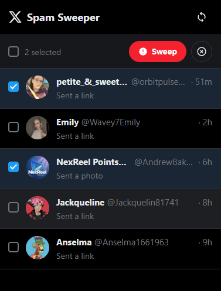

# X Spam Sweeper

    

    
      <b><strong style="font-size: 5rem;">X Spam Sweeper</strong></b>
       "A lightweight Chrome extension to batch report and block spam accounts in X Messages."
    

 
 

    

## Why X Spam Sweeper?

Tired of manually dealing with dozens of spam message requests on X (Twitter)? X Spam Sweeper lets you view, select, and batch-process spam accounts directly from a convenient popup — saving you time and clicks.

> **Note:** This extension is currently in early development. Report and block functionality coming soon!

## Features

* **View Message Requests:** See all your pending message requests in a clean, dark-themed list that matches X's design
* **Multi-Select:** Select individual accounts or use "Select All" to choose multiple spammers at once
* **Real-time Extraction:** Automatically extracts usernames, display names, avatars, message previews, and dates from the X page
* **Native Design:** Dark theme UI that feels like a natural part of X
* **Report & Block (Coming Soon):** Batch report and block selected accounts with one click

## How to Use

1. **Navigate:** Go to [x.com/messages/requests](https://x.com/messages/requests)
2. **Click:** Click the X Spam Sweeper extension icon in your toolbar
3. **Select:** Check the spam accounts you want to deal with (or use Select All)
4. **Action:** Use the Report or Block buttons to take action (coming soon)

## Installation

1. Clone this repository: `git clone https://github.com/jonasfroeller/x-spam-sweeper.git`
2. Open Chrome and navigate to `chrome://extensions`
3. Enable "Developer mode" in the top-right corner
4. Click "Load unpacked" and select the cloned repository folder

## Privacy & Permissions

- **`activeTab`** - Access to the current tab when you click the extension
- **`tabs`** - Query tab information to communicate with the content script
- **Content Script** - Runs only on `x.com` and `twitter.com` to read message request data

**No analytics, tracking, or external requests.** All processing happens locally in your browser. The extension only reads data from the X messages page — it does not store or transmit any information.

## License

This project is licensed under the GPLv3 License. See the `LICENSE` file for details.

Copyright © 2025 Jonas Fröller
